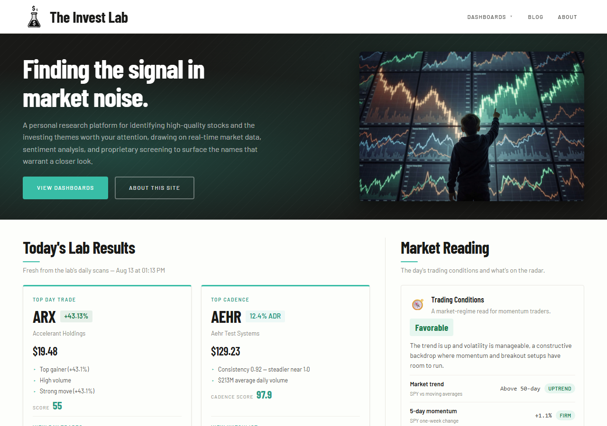
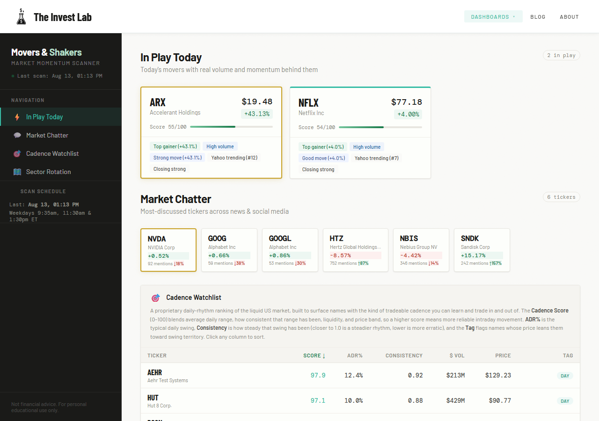
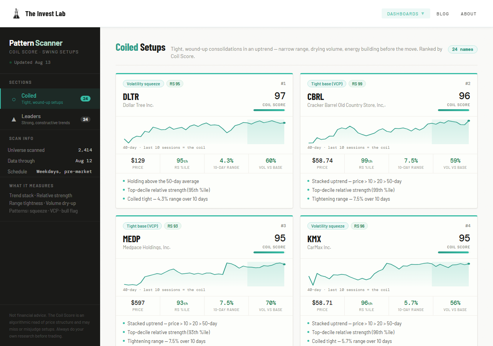
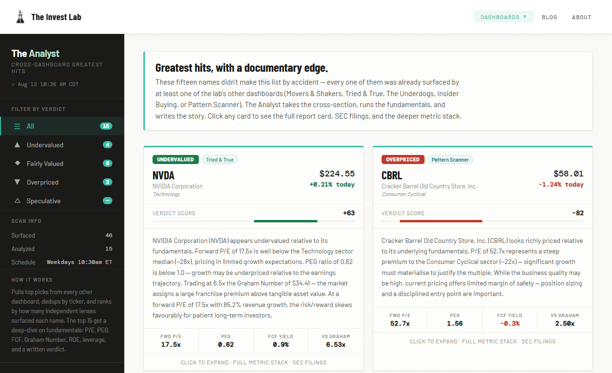

# The Invest Lab

**A self-updating stock research platform: an automated data pipeline, five analytics dashboards, and a set of proprietary scoring engines that grade their own predictions.**

🔗 **Live site: [theinvestlab.com](https://theinvestlab.com)**

> Built as a personal research tool and an exercise in end-to-end data engineering: collection → scoring → publication → **measured outcomes**. Educational only, not financial advice.



---

## What it does

Every weekday, without anyone touching it, the platform pulls market data from six sources, scores roughly 2,500 liquid US stocks through several custom ranking engines, publishes the results to five dashboards, and then **tracks how its own picks actually performed 30 days later**.

| Dashboard | What it surfaces |
|---|---|
| **[Movers & Shakers](https://invest-movers-shakers.onrender.com)** | Day-trade candidates, sector rotation, social chatter velocity |
| **[The Marathon](https://invest-the-marathon.onrender.com)** | Long-term holds: ETF consensus, deep value, fund scorecards |
| **[Insider Buying](https://invest-insider-buying.onrender.com)** | Corporate insider purchases scored on a backtested model, plus a Congress tab built from House filings |
| **[Pattern Scanner](https://invest-patterns.onrender.com)** | Coiled swing setups and constructive market leaders |
| **[The Analyst](https://invest-the-analyst.onrender.com)** | Daily "all-star" board: top names from every dashboard, with fundamental valuation verdicts |

---

## A look inside

**Movers & Shakers** is the intraday scanner. It carries momentum candidates scored 0–100, a Sector Rotation map of where money is flowing, a chatter panel tracking mention *velocity* across Reddit and StockTwits, and the Cadence Watchlist, which ranks stocks by how tradeable their daily rhythm is.



**Pattern Scanner** runs the Coil Score engine. It hunts for stocks wound tight before a move: a narrowing range, drying volume and an intact uptrend. Each card carries a 40-day sparkline with the consolidation window shaded.



**The Analyst** is the cross-dashboard board. Names surfaced by any other engine run through a fundamental valuation model that produces a −100…+100 verdict score and explains its reasoning in plain English.



**Insider Buying** holds two boards. *Corporate* scores open-market executive purchases. *Politician* is built from the House Clerk's own Periodic Transaction Reports, parsed straight out of the filing PDFs.

---

## The part I am most willing to be judged on

I built the insider conviction model on informed judgement, then measured it. It was wrong.

`insider_backtest.py` reconstructs **22,600 historical insider buying clusters** from five years of SEC Form 4 filings, scores each using only what was knowable that day, and compares the forward 60-day return against a size-matched benchmark. Entry is the *filing* date, never the trade date, because you cannot act on a form you cannot see.

The result was uncomfortable. The model had been ranking names close to backwards: clusters scoring 70–84 trailed the index by 2.84% at a 39.9% win rate, worse than clusters scoring under 40. Price context, which carried **zero** weight, turned out to be the only dimension that separated outcomes consistently. Cluster size, which I had weighted most heavily, turned out to be a confound. It only looked bad because large clusters concentrate in distressed companies.

So the model was rebuilt around the evidence, the weak dimensions were cut, and [the methodology panel says so publicly](https://invest-insider-buying.onrender.com). The effects are modest and drawn from a single market regime, and it says that too.

---

## The part I'd point a data team at

**1. It grades its own homework.**
Every scan archives its top pick with an entry price. A scheduled job fills in the 30-day outcome once, as a fixed snapshot that is never revisited or quietly revised. The homepage publishes the aggregate: winners, losers, and hit rate. Day-trade picks are also graded at the close of the same day, the next day and five sessions out, because a 30-day clock is the wrong one for a same-day idea. Being able to say *"here is how the model actually did"* was the whole point.

**2. Unproven signals stay out of the public numbers.**
A newer experiment flags stocks whose social-mention volume is accelerating, on the theory that chatter precedes breakouts. It is archived and scored every day, but it is deliberately **excluded from the published track record** until it has enough matured outcomes to justify a place there. Measure first, publish second.

**3. Data-quality defenses, learned the hard way.**
- Python's `json.dump` emits bare `NaN`, which Python accepts and JSON does not, so browsers reject the entire file. A single unguarded division silently broke every dashboard while `curl` and Python read it back fine. All writes now go through a NaN-safe serializer.
- The Coil engine once ranked pending-acquisition stocks at the very top. A buyout target gaps once, then trades pinned near the deal price on drying volume, which is a mathematically *perfect* "coiled spring" that can never break out. A liveliness filter now screens them out.

**4. Statistics over gut feel.**
Percentile ranks, z-scores and relative strength against a benchmark, rather than raw returns. A sector up 1% on a day the S&P gains 2% is *losing* ground, and the tooling says so.

---

## Proprietary scoring engines

| Engine | Idea | Inputs |
|---|---|---|
| **Coil Score** | How wound-up is this setup before it moves? | Trend stack, relative strength, range tightness, volume dry-up |
| **Cadence Score** | Does this stock have a *tradeable daily rhythm*? | Average daily range, consistency, liquidity, price band |
| **Macro Temperature** | Market regime, Cold → Hot | Ten inputs in four themes: trend and participation, risk appetite, sentiment, credit and rates |
| **Trading Conditions** | Is today worth trading? | Today's tape and sector breadth, trend, momentum, seasonally adjusted volume, VIX, rates |
| **Sector Rotation** | Where is money actually flowing? | Relative strength vs S&P, momentum quadrants (RRG), conviction volume |
| **Verdict Score** | Is this fundamentally cheap or expensive? | P/E vs sector, PEG, growth, margins, FCF yield, Graham number |
| **Insider Conviction** | Is this insider purchase informative? | Price context, cluster size, role seniority, position growth. **Weights set by backtest.** |

---

## Architecture

```
GitHub Actions (11 scheduled workflows)
        │
        ├─ Pull: Polygon · Finnhub · yfinance · FRED · Reddit/ApeWisdom
        │        SEC EDGAR · House Clerk disclosures · OpenInsider
        ├─ Score: proprietary engines (Python)
        └─ Commit JSON  ──────────────┐
                                      │ push triggers auto-deploy
                                      ▼
                            Render.com (5 services)
                            ├─ Flask app  → dashboard + CORS JSON API
                            └─ 4 static sites → read their own data/*.json
                                      │
                                      ▼
                            Static homepage (theinvestlab.com)
```

**Design note:** the scans are decoupled from the web tier entirely. Workflows write JSON into the repo, and the commit *is* the deployment trigger. There is no database and no runtime API call to fail, so dashboards load pre-computed results instantly and a vendor outage can't take them down.

**Tech:** Python (pandas, yfinance, BeautifulSoup, requests) · Flask · vanilla JS + SVG (no frontend framework) · GitHub Actions · Render · GoDaddy

---

## Repository layout

Everything the site is made of lives under `Website/`. The repository root holds
only deployment and automation config.

```
├── Website/                    # the platform itself
│   ├── index.html              #   homepage: lab results, market reading, track record
│   ├── blog.html  ·  Blog/     #   research write-ups (markdown + manifest)
│   ├── styles.css              #   shared design system
│   ├── scripts/                #   scheduled scan engines: the data pipeline
│   │   ├── coil_scan.py                # Coil Score, for swing setups
│   │   ├── cadence_scan.py             # Cadence Score, for day-trade rhythm
│   │   ├── market_temperature_scan.py  # Macro Temperature regime gauge
│   │   ├── analyst_scan.py             # cross-dashboard "all-star" selection
│   │   ├── newsstand_scan.py           # Trading Conditions read
│   │   ├── insider_pulse_scan.py       # market-wide insider buy/sell breadth
│   │   ├── insider_backtest.py         # research harness that measures the conviction model
│   │   ├── capitol_flow_scan.py        # House PTR filings → congressional trades
│   │   ├── archive_nominee.py          # records each scan's top pick
│   │   └── calculate_outcomes.py       # grades picks → track record
│   ├── MarketDashboard/        #   Movers & Shakers (Flask app + scan)
│   ├── TheMarathon/            #   Tried & True · Underdogs · ETF Scorecard
│   ├── InsiderBuying/          #   Corporate + Politician tabs
│   ├── PatternScanner/         #   Coil Score dashboard
│   └── TheAnalyst/             #   daily all-star board
├── .github/workflows/          # the schedule that drives everything
└── render.yaml                 # reference map of the five Render services
```

Each dashboard folder is self-contained, with its own `index.html`, its `scan.py`
where applicable, and a `data/` folder holding the JSON its scans produce. That
is what lets Render deploy them as five independent services from one repo.

---

## A note on the commit history

Most commits in this repository read `chore: market scan …` and were made by a bot. That is the pipeline working as designed. Scheduled workflows commit fresh scan results several times a day, and each commit is what deploys the updated dashboards. Human-authored commits are the ones with conventional prefixes (`feat:`, `fix:`, `polish:`).

---

## Disclaimer

A personal research and educational project. Nothing here is investment advice, and the scoring engines are algorithmic reads of price and fundamental data that can and do misjudge. Always do your own research.
